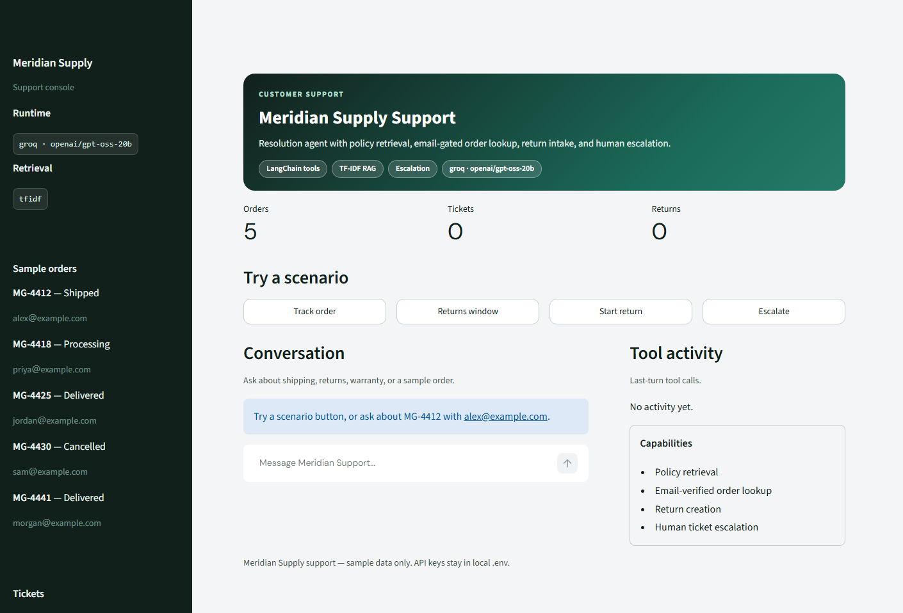

# Meridian Supply — Customer Support Resolution Agent

Tool-calling support agent for Meridian Supply: policy retrieval, email-gated
order lookup, return intake, and human escalation.

**Stack:** LangChain · TF-IDF retrieval · Streamlit · Groq



## Features

- LangChain tool-calling agent over Meridian policy docs
- Local TF-IDF knowledge retrieval
- Email-verified order lookup
- Return creation and human ticket escalation
- Streamlit console with per-turn tool activity

## Setup

```bash
git clone https://github.com/laraibQ/customer-support-resolution-agent.git
cd customer-support-resolution-agent
python -m venv .venv
source .venv/bin/activate   # Windows: .\.venv\Scripts\Activate.ps1
pip install -e ".[dev]"
cp env.example .env         # Windows: copy env.example .env
python ingest.py
streamlit run app.py
```

CLI: `python main.py`

| Variable | Default |
| -------- | ------- |
| `LLM_PROVIDER` | `groq` |
| `GROQ_MODEL` | `openai/gpt-oss-20b` |
| `RETRIEVAL_BACKEND` | `tfidf` |

## Architecture

```
User message
    │
    ▼
Streamlit (app.py) / CLI (main.py)
    │
    ▼
LangChain agent (meridian_support.agent)
    │  Groq (OpenAI-compatible)
    │ tool calls
    ▼
meridian_support.tools
  ├─ get_order_details       → orders.json
  ├─ search_policies         → TF-IDF index
  ├─ search_returns_policy   → returns.md
  ├─ open_return_request     → returns.json
  └─ escalate_to_human       → tickets.json
```

Details: [ARCHITECTURE.md](ARCHITECTURE.md)

## Deployment

Host on a platform that runs a persistent Python process (Streamlit Community
Cloud, Hugging Face Spaces, Railway, or Render). Set `GROQ_API_KEY` (and optional
overrides) in the host secrets. The TF-IDF index is built on first search if
`kb_index/` is missing.

Streamlit Cloud main file: `app.py`.

## Tests

```bash
pytest -q
```

## Example queries

- `Where is MG-4412? Email alex@example.com`
- `How many days do I have to return unused items?`
- `Open a return for MG-4425, jordan@example.com, wrong size`
- `Package arrived cracked — escalate`

## Project layout

```
app.py                 Streamlit UI
main.py                CLI
ingest.py              Build TF-IDF index
meridian_support/      Agent package
data/                  Policies and sample orders
docs/ui.png
requirements.txt
tests/
```

## License

MIT
